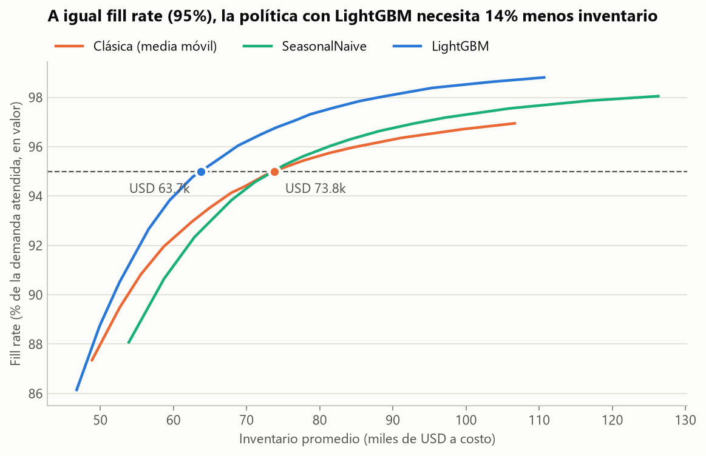
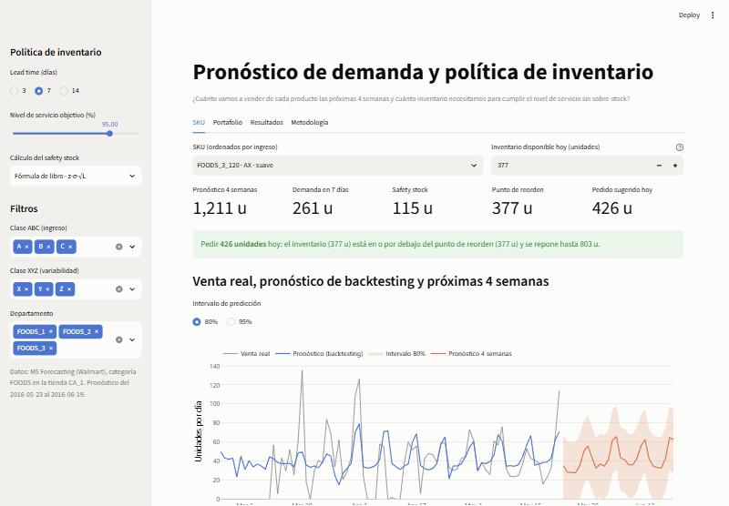
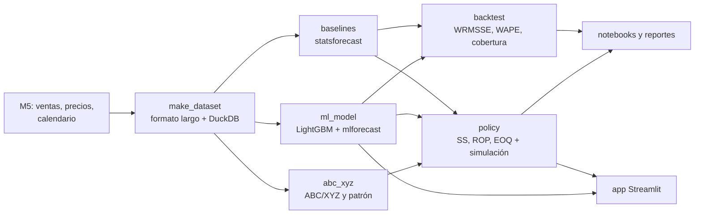

# Pronóstico de demanda y política de inventario

[](https://github.com/isaacmartinez23/demand-forecasting-inventory/actions/workflows/ci.yml)


> **Pregunta de negocio:** ¿cuánto vamos a vender de cada producto las próximas 4 semanas y
> cuánto inventario debemos tener para cumplir un nivel de servicio del 95% sin sobre-stock?

Proyecto de supply chain que va **del pronóstico a la decisión**: un modelo de demanda por
SKU-tienda se traduce en safety stock, punto de reorden y cantidad a pedir, y la política
resultante se valida simulándola contra demanda real que el modelo no vio.

**Datos:** [M5 Forecasting](https://www.kaggle.com/competitions/m5-forecasting-accuracy)
(Walmart) — categoría FOODS en la tienda CA_1: 1,429 SKUs, 2011–2016.

## Resultado

**A igual nivel de servicio (95% de fill rate, lead time de 7 días), la política basada en
el modelo necesita 14% menos inventario promedio que una política clásica de media móvil.**



| Métrica de éxito | Resultado |
| --- | --- |
| El modelo supera a SeasonalNaive en WRMSSE | **0.528 vs 0.785 (−33%)**, en las 3 ventanas. Contra el mejor baseline (AutoETS, 0.608): −13% |
| Fill rate ≥ 95% en SKUs clase A | **96.8%** en la simulación (87% de los SKUs A lo cumple individualmente) |
| Inventario a igual servicio vs. política clásica | **−14%** total (USD 63.7k vs 73.8k), −11% clase A, −25% clase B |
| Reproducible con `make all` | Sí; CI corre el pipeline completo sobre datos sintéticos |

Resumen de una página: [reports/executive_summary.md](reports/executive_summary.md).

## Lo que encontré

1. **El modelo gana donde hay volumen y pierde en la cola.** Mejora el WAPE en los
   segmentos AX y AY (74% del ingreso) y empeora hasta 16% en CZ, donde una media móvil es
   mejor. La recomendación no es "ML para todo" sino segmentar.
2. **El ahorro de inventario crece con el lead time:** −7% con 3 días, −14% con 7 y −22% con
   14. A 90% de fill rate la diferencia es de solo 2–4%.
3. **`z` no entrega lo que promete.** Con el factor de seguridad para 95%, el nivel de
   servicio de ciclo realmente logrado fue 90% (y 82% con la política clásica). Fill rate y
   servicio de ciclo son métricas distintas y conviene reportar ambas.
4. **Sofisticar el safety stock no lo hizo más eficiente.** Probé σ del error acumulado en el
   lead time y cuantiles empíricos del error en lugar de `z·σ·√L`: mejor calibración, mismo
   inventario para el mismo servicio. Lo que mueve la curva es el pronóstico.
5. **Los intervalos de predicción quedan cortos:** 74% de cobertura real para el intervalo de
   80% y 89% para el de 95%, medidos fuera de muestra. No cumple el objetivo de ±5 puntos
   que me había fijado.
6. **Una variable "obvia" empeoraba el modelo.** `item_id` como categórica (1,429 niveles)
   subía el WRMSSE 5.6% en las ventanas de calibración; quedó fuera.

Detalle en los notebooks:
[01 EDA](notebooks/01_eda.ipynb) ·
[02 Baselines](notebooks/02_baselines.ipynb) ·
[03 LightGBM](notebooks/03_lightgbm.ipynb) ·
[04 Política de inventario](notebooks/04_inventory_policy.ipynb)

## Demo

App de Streamlit: selector de SKU, pronóstico de 4 semanas con intervalo, safety stock,
punto de reorden y pedido sugerido, recalculados en vivo al cambiar lead time, nivel de
servicio e inventario disponible.



```bash
make app
```

La app solo lee los parquet de `app/data/` (2 MB, versionados): no entrena ni necesita M5.

## Arquitectura



## Metodología

**Evaluación.** 6 ventanas móviles de 28 días con reentrenamiento. Las 3 últimas
(2016-02-29 → 2016-05-22) son de **evaluación** y son las únicas que se reportan. Las 3
anteriores son de **calibración**: ahí se decidieron las variables del modelo y se estimó la
incertidumbre del pronóstico, para no tomar ninguna decisión mirando el periodo reportado.

**Pronóstico.** LightGBM global (objetivo Tweedie) con lags 7/14/28, medias móviles, día de
la semana, SNAP, eventos, días hasta el próximo evento y precio relativo. Baselines: Naive,
SeasonalNaive, media móvil de 28 días, AutoETS y AutoARIMA.

**Inventario.** Política (s, S) con revisión diaria y ventas perdidas:

- Safety stock = `z · σ(error del pronóstico) · √L`
- Punto de reorden = demanda esperada en el lead time + safety stock
- Lote = EOQ, acotado entre 1 y 14 días de demanda

Cada política se simula día a día contra la demanda real de las 12 semanas de evaluación.
Como cada una termina con un nivel de servicio distinto, la comparación se hace sobre la
**curva servicio–inventario**: cuánto inventario necesita cada política para alcanzar el
mismo fill rate.

## Cómo reproducirlo

Requisitos: [uv](https://docs.astral.sh/uv/) y `make`.

```bash
uv sync
```

Descarga los datos de M5 (requiere cuenta de Kaggle y aceptar las reglas de la competencia).
Con la CLI autenticada (`kaggle auth login`) lo hace `make data`; si no, deja
`calendar.csv`, `sales_train_evaluation.csv` y `sell_prices.csv` en `data/raw/`.

```bash
make all
```

`make all` corre datos → clasificación → baselines → modelo → ablaciones → evaluación →
política → datos de la app. En una máquina de 32 núcleos tarda ~35 minutos, casi todo en
AutoETS y AutoARIMA; con `DFI_SKIP_ARIMA=1` se omite AutoARIMA, que no alimenta la política.

```bash
make notebooks
```

Para probar el pipeline sin M5, con un dataset sintético del mismo formato (es lo que hace CI):

```bash
DFI_DATA_DIR=/tmp/dfi-data make synthetic all
```

La tienda y la categoría se eligen con las variables de entorno `M5_STORE` y `M5_CAT`
(por defecto `CA_1` y `FOODS`).

## Estructura

```
├── src/
│   ├── data/          # descarga, formato largo, M5 sintético, datos de la app
│   ├── features/      # calendario, eventos y precio relativo
│   ├── models/        # baselines, LightGBM, intervalos, backtesting, ablaciones
│   ├── inventory/     # ABC/XYZ, safety stock, ROP, EOQ y simulación
│   └── utils/         # métricas (WRMSSE) y estilo de figuras
├── notebooks/         # 01–04, fuente .py (jupytext) + .ipynb ejecutado
├── app/               # Streamlit + parquet livianos
├── reports/           # figuras y resumen ejecutivo
├── tests/             # política, simulación, métricas, fuga de datos
└── .github/workflows/ # CI: lint, pruebas y pipeline sobre datos sintéticos
```

## Limitaciones

- **Ventas, no demanda.** M5 registra lo vendido: un quiebre real aparece como venta cero y
  la simulación lo trata como ausencia de demanda.
- **Costos supuestos.** M5 no trae costos; se asume costo unitario de 70% del precio, 25%
  anual de costo de mantener y USD 5 por pedido. Al variarlos, el ahorro se mantuvo entre
  12.8% y 13.7%.
- **Lead time fijo**, sin mínimos de compra, capacidad de almacén ni caducidad.
- **Una tienda y una categoría.** El WRMSSE usa la jerarquía de este subconjunto y no es
  comparable con el leaderboard de Kaggle.
- **Las políticas se actualizan cada 28 días.** No se evaluó una actualización más frecuente.

## Stack

Python 3.12 · pandas · DuckDB · statsforecast · mlforecast · LightGBM · SciPy · Streamlit ·
Plotly · uv · ruff · pytest · GitHub Actions

---

Isaac Martínez · [isaacmartinez.space](https://isaacmartinez.space)
